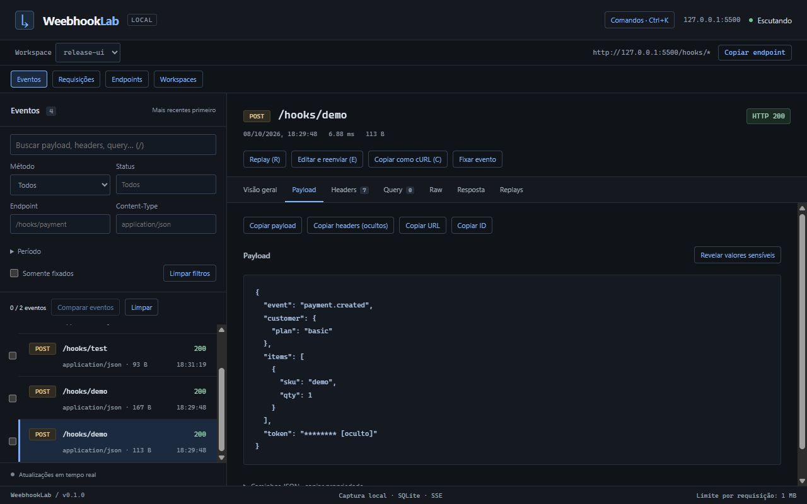

# WeebhookLab

A local-first TypeScript tool for capturing, inspecting, replaying, comparing, and debugging webhooks. It runs an HTTP capture endpoint and a React inspector on one port, with persistent SQLite storage and no external services.

**0.1.0 release candidate. Not published to npm.** The package remains private and unlicensed until the owner approves a license and supplies the public repository URL. The interface is in Brazilian Portuguese.

## Screenshots

Real captures from the production build on Windows, using synthetic local requests:



[First run](docs/images/first-run.jpg) · [Replay editor](docs/images/replay-editor.jpg) · [Structural comparison](docs/images/structural-diff.jpg) · [Mock response](docs/images/mock-response.jpg) · [Small-screen inspector](docs/images/small-screen.jpg)

## Quick start

Requires Node.js **22.13 or newer**, with npm. Node 22 may print an experimental warning for its built-in SQLite API. Docker, database servers, accounts, and API keys are unnecessary.

From the source directory:

```sh
npm ci
npm run build
npm start -- --no-open
```

Open [127.0.0.1:5050](http://127.0.0.1:5050). Send a webhook from PowerShell:

```powershell
Invoke-WebRequest -Method Post -Uri 'http://127.0.0.1:5050/hooks/test' -ContentType 'application/json' -Body '{"event":"hello.world"}'
```

On POSIX shells:

```sh
curl -X POST http://127.0.0.1:5050/hooks/test \
  -H 'Content-Type: application/json' \
  -d '{"event":"hello.world"}'
```

The empty inspector also provides a working PowerShell example and a Copy action. Capture does not need a valid JSON body.

## Install the local release package

Build and create the distribution:

```sh
npm pack
```

Install the resulting tarball outside the source directory:

```sh
npm install -g /path/to/weebhooklab-0.1.0.tgz
weebhooklab --no-open
```

On Windows, use the tarball's actual path, for example `npm install -g '.\weebhooklab-0.1.0.tgz'`. The installed command opens the browser by default; `--no-open` disables that action. If browser opening is unavailable, use the printed dashboard URL.

After an authorized npm publication, the intended commands are `npx weebhooklab` and `npm install -g weebhooklab`. They are publication targets, not an installation path currently offered by this project. An npm registry lookup on 2026-10-08 returned 404 for this name; this does not reserve the name or guarantee publish permission.

## Capture and inspection

- `/hooks/*` accepts GET, POST, PUT, PATCH, DELETE, and OPTIONS. Bodies up to **1 MiB (1,048,576 bytes)** are accepted; larger bodies return HTTP 413 without being stored.
- JSON, invalid JSON, text, forms, multipart, binary content, compression, and empty bodies retain their original bytes. Multipart files are not extracted to disk.
- Inspect the overview, payload, headers, repeated query parameters, reconstructed HTTP request, raw body Base64, and the configured capture response. Raw body bytes exclude transport framing such as chunk boundaries.
- JSON previews stop at 64 levels, 20,000 values, or 1 MiB of content. Opaque bodies have a bounded hexadecimal preview. Original bytes remain available through explicit reveal.
- Events have persistent sequence ordering. Lists return summaries in pages of 50, with cursors and server-side search/filtering. Payloads load only when selected. Reconnection refreshes the latest page while keeping the selected event; older pages can be loaded again.
- SSE subscriptions follow the selected workspace. The inspector distinguishes connecting, listening, reconnecting, and offline states. Failed connections retry with increasing delays up to 30 seconds.

The recorded processing duration covers application handling and persistence, including mock delay; it is not network transit time.

## Replay and request editing

Select an event and choose Replay or Edit and resend. Set the destination, method, headers, query, body, and timeout, then confirm the destination and execute. Each attempt sends a real HTTP request and stores its actual result.

Transport headers are recalculated, including Host and Content-Length. Duplicate application headers and original body bytes are retained. Binary, multipart, compressed, and non-UTF-8 bodies support byte-preserving replay but not text editing. Edited text uses UTF-8. Changing the body can invalidate webhook signatures; signatures are not recalculated.

HTTP 400/500 responses are execution results, separate from connection errors. Connection refusal, DNS failure, TLS failure, timeout, cancellation, partial responses, and interrupted executions have explicit states. Redirects are returned without being followed. Timeouts range from 100 ms to 120 seconds, response buffering is capped at 1 MiB, and up to 10 outgoing replays run concurrently. There is no automatic resend.

Save the edited configuration as an independent reusable request. Saved definitions and their execution histories persist. Deleting a definition retains its archived executions in workspace export.

## Comparison and transformations

Select two events to compare structured JSON, request metadata, repeated headers/query, or text lines. Compare an original request with its edited configuration or an execution, and compare two execution requests or responses. Unified and side-by-side views support navigation between changes.

JSON property order is ignored; null differs from an absent property. Arrays and text lines are compared by index. Binary/compressed or unsupported charset bodies report byte equality without a textual diff. Comparisons are bounded to 1 MiB bodies, 64 levels, 20,000 values, and 1,000 changes, displayed in batches of 50.

JSON paths can be copied as `$.customer.plan`, `$.items[0]`, or `$["name.with.dots"]`. Set/Delete/Rename pipelines can be enabled, reordered, previewed, and saved. Set requires existing parents and can append an array element. Delete shifts array indexes. Rename stays in the same object and rejects collisions. Prototype properties cannot be modified. Transformations change an editor copy and require a separate explicit replay to send it.

Provider hints recognize GitHub, Stripe, Shopify, Discord interactions, and generic HTTP clients. Confidence and evidence are shown; conflicting indicators yield Unknown. **A signature header does not establish authenticity.**

## Mock responses and workspaces

In Endpoints, create a response profile and apply it to an exact `/hooks/...` path. Query strings do not affect matching. Configure a final status from 200–599, custom headers, UTF-8 text up to 64 KiB, and a fixed or random delay from 0–10 seconds. Statuses 204/205/304 require an empty body. Transport/compression headers are calculated by the server. At most 20 delayed captures run simultaneously; excess requests return 429 without capture. Without an association, capture returns HTTP 200 and `{"received":true}`. Deleting a profile removes its associations. Historical events retain their original capture response.

Workspaces isolate events, pins, saved requests, mocks, pipelines, and replay histories. Captures belong to the active workspace at request arrival, including when it changes during a delay. An in-flight replay retains its original workspace.

Export/import uses `weebhooklab-workspace` JSON version 1, capped at 10 MiB, 1,000 events, 1,000 executions, and 500 configurations. Import validates the schema and references, assigns new IDs, creates another workspace, and neither activates it nor executes requests. Redacted exports may require restoring credentials before replay.

## CLI reference

| Option | Behavior |
| --- | --- |
| `--port 8080` | HTTP port, 1–65535; default 5050 |
| `--host 127.0.0.1` | IPv4, IPv6, or localhost; default 127.0.0.1 |
| `--no-open` | Do not launch a browser |
| `--workspace my-project` | Select or create a workspace by name; duplicate names require dashboard selection |
| `--help` | Print usage without starting the server |
| `--version` | Print the package version without starting the server |

Startup success appears only after the listener, inspector assets, and storage are ready. An occupied port produces an actionable error. SIGINT/SIGTERM close the listener, SSE clients, pending delays, outgoing replays, and SQLite. Other inbound connections have up to five seconds to finish before being closed; partial request bodies are not stored. Use Ctrl+C to stop a foreground instance.

## Storage and security

The installed CLI stores data independently of the current working directory:

| Platform | Default directory |
| --- | --- |
| Windows | `%LOCALAPPDATA%\WeebhookLab` |
| macOS | `~/Library/Application Support/WeebhookLab` |
| Linux | `$XDG_DATA_HOME/weebhooklab` or `~/.local/share/weebhooklab` |

The database is `events.sqlite`. Set `WEEBHOOKLAB_DATA_DIR` to use another directory. For compatibility, `npm start` and `npm run dev` keep the existing source checkout's `data/events.sqlite` unless that variable is set. Installing the package does not move or erase the source database. To reuse it, point the installed CLI to that existing `data` directory while the source instance is stopped. Run one instance per data directory.

PowerShell example:

```powershell
$env:WEEBHOOKLAB_DATA_DIR = 'C:\WebhookData'
weebhooklab --port 8080 --no-open
```

Data is stored locally **without encryption**, including original credentials and customer payloads. Preserve SQLite's `-wal` and `-shm` companions when backing up a running database, or stop the application before copying it. Schema upgrades retain earlier captures, pins, and execution histories.

Headers and recognizable credential fields are masked by default, with an explicit reveal action for debugging. The local detail API returns originals. Export hides sensitive headers/query/JSON/form fields and transformation values under sensitive paths; opaque bodies are omitted. Including originals requires an explicit export option and displays a warning. Redaction cannot identify every secret or piece of personal information in free-form content; inspect files before sharing them. Capture never rewrites the stored original. Logs omit payloads and credentials.

The server binds to loopback by default. External origins and unexpected Host values are refused. `--host 0.0.0.0` or another network interface deliberately permits network access and prints a warning: the dashboard and API have no authentication. Protect the network and local files when using that option. Replay permits HTTP/HTTPS destinations only, rejects URL credentials, and requires deliberate execution in the interface. Incoming request text is rendered as text, with a restrictive production Content Security Policy.

## Architecture

```text
Incoming HTTP → Fastify capture → normalization → SQLite transaction
                                              → summary API / SSE → React inspector
Captured event / saved request → replay editor → Node HTTP/HTTPS client
                                              → actual result → SQLite history / inspector
```

`src/server` owns capture, storage/migrations, replay, SSE, workspace routes, and the CLI. `src/shared` contains typed contracts, comparison, transformation, provider, and redaction logic without React. `src/web` contains the inspector and editors. The distribution contains compiled server/shared modules and built frontend assets; React and Vite are build-time dependencies.

## Development and verification

```sh
npm ci
npm run dev
npm run lint
npm run typecheck
npm test
npm run build
npm run test:package
```

Development uses [127.0.0.1:5173](http://127.0.0.1:5173), proxying capture/API to loopback port 5050. Restart development after backend edits; frontend edits use HMR.

Tests use local receivers and temporary databases for capture bytes, invalid content, limits, SSE isolation, replay results/errors/cancellation, pagination, migration rollback, persistence, transformations, mocks, redaction, and workspace import/export. Performance checks cover 100, 1,000, and 10,000 summary records and 1 KiB/100 KiB/1 MiB inspection; 5 MiB is deliberately rejected by the capture limit.

`test:package` builds, runs `npm pack`, inspects the allowlisted contents and screenshot links, installs into an isolated project with production dependencies, resolves the executable, and exercises capture, edit/replay, history, mock responses, export/import, demo, restart, SSE closure, and port release. It leaves the tarball in the source root and the disposable installation under `.release-validation`. On Windows, its signal tests inject SIGINT/SIGTERM through IPC because Node cannot send POSIX signals to a child there. A separate terminal Ctrl+C check confirmed port release and persisted data; that terminal wrapper did not provide evidence of a graceful process exit code. npm registry access or a populated cache is required for the clean install.

The production build, installed CLI, and browser workflows were exercised on Windows with Node 22.14. macOS/Linux data-directory selection has unit coverage; native execution and automatic browser opening on those platforms have not been verified.

GitHub Actions defines Windows install, lint, typecheck, tests, and package validation. The workflow runs after the project is added to a repository and pushed; there is no publishing or deployment step.

## Examples

With the application running, send three deterministic demonstration events:

```sh
npm run demo
```

For another local port: `npm run demo -- http://127.0.0.1:8080/hooks/demo`. The script uses Node's built-in HTTP client, sends only synthetic data to loopback, and adds ordinary captures to the active workspace. It needs no credentials or external receiver.

See [CONTRIBUTING.md](CONTRIBUTING.md) for setup and review expectations, and [CHANGELOG.md](CHANGELOG.md) for the initial candidate entry.

## License

Released under the [MIT License](LICENSE). Copyright (c) 2026 braz.
